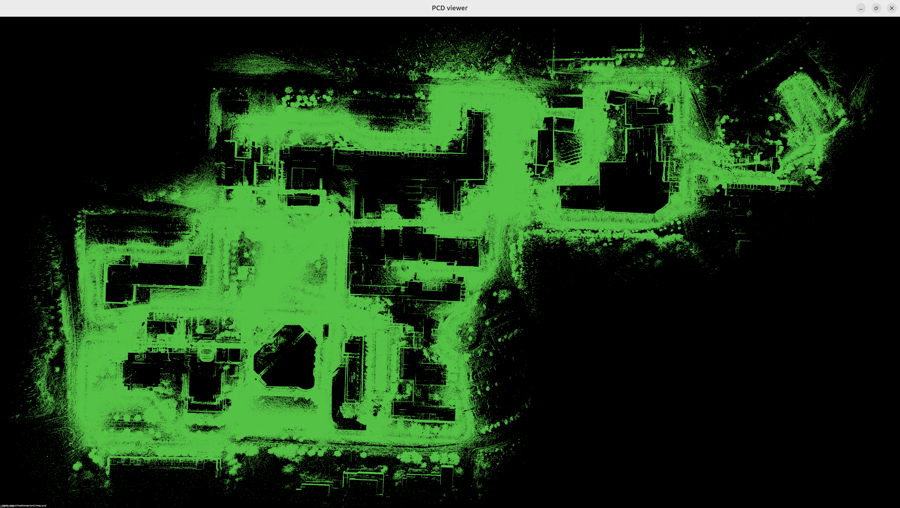
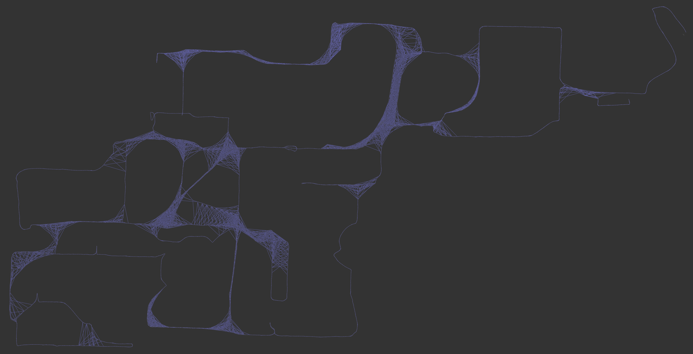
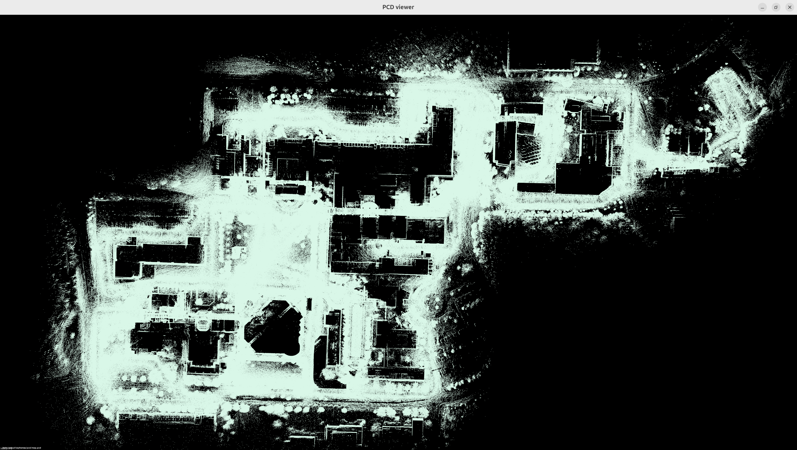
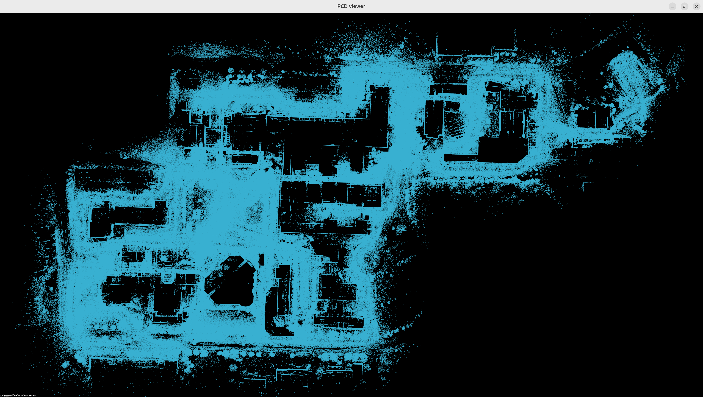
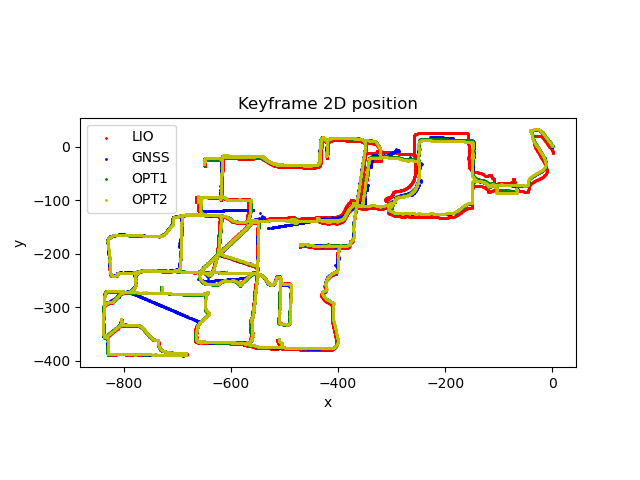
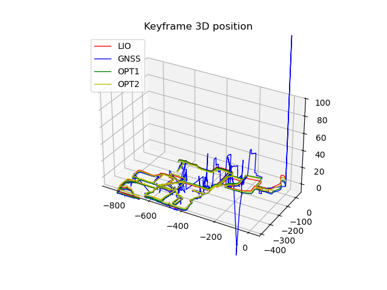
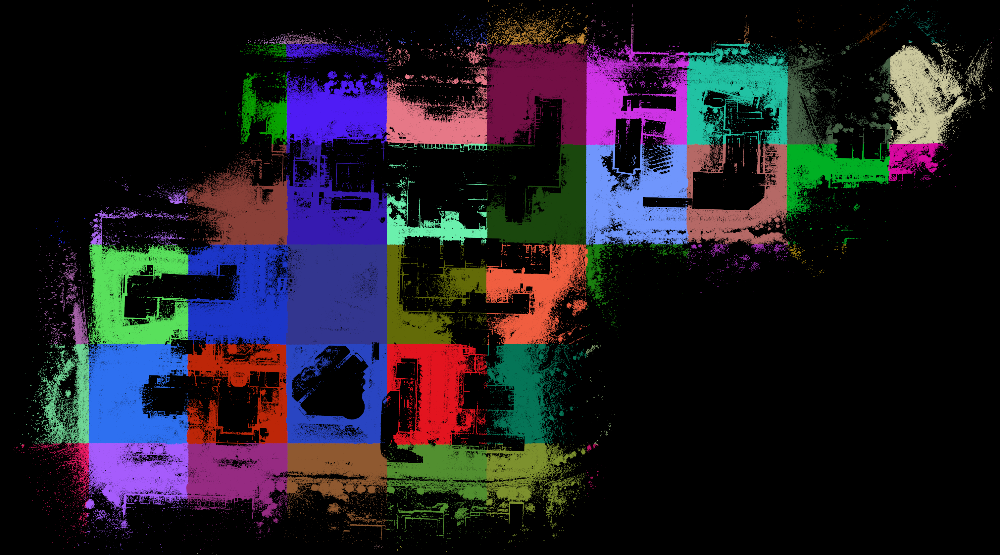

## Offline Mapping System

### Components

1. Front End
2. Loop Closure
3. Optimization

### Front End

Goal: Use IESKF Lidar IMU Odometry to create Keyframes with timestamp lio pose, scan, gnss pose (not used in lio), etc.

#### Procedure

1.  GNSS data processing:
    1. ros message `sensor_msgs::NavSatFix` to `GNSS`
    2. compute UTM coordinates (x, y, z) from lon, lat, alt
    3. use the position of first valid GNSS data (status >= STATUS_FIX) as origin
    4. store GNSS data with timestamp in array
2.  Run ieskf lidar imu odometry
    1. add point cloud data and imu data to lio
    2. if new keyframe was created, (a) store pointcloud as pcd file , (b) match pointcloud data with gnss data, store gnss position/pose in keyframe if it's valid
    3. store all keyframe data in txt file

#### Code

- [source code](src/mapping/FrontEnd.cpp)

- [executable](src/app/main_frontend.cpp)
  - run frontend: `./bin/main_frontend`

- [create global map](src/app/merge_kfs.cpp)
  1.  merge keyframes: `./bin/merge_kfs --pose_type=lio`
  2.  show map: `pcl_viewer ./data/output/keyframes/pcd/map.pcd`

   

### Loop Closure

Goal: find keyframes that are spatially close but created at different times

#### Procedure

1. Find Candidate
   1. go through all keyframe pairs
   2. skip keyframes that were temporally close
   3. skip keyframes that are close to previous detected loop keyframe pairs
   4. candidate detected if the distance is small enough
2. evaluate candidates: scan (query keyframe) to map (submap of target keyframe)
   - build submap of keyframes temporally close to target keframe
   - get pointcloud of query keyframe from pcd file
   - match scan to submap with ascending resolutions
   - compute score of NDT alignment
3. remove outliers with low score

#### Code

- [source code](src/mapping/LoopClosure.cpp)

- [executable](src/app/main_loopclosure.cpp)
  - run loop closure detection: `./bin/main_loop`

- pose graph structure:

  

### Optimization

Goal: Refine keyframe pose by pose graph optimization

#### Procedure

1.  ICP alignment between gnss and lio trajectory
2.  Build Pose graph
    - create optimizer
    - create vertices: keyframes
    - create edges: gnss position, relative motion between two keyframes based on lio, loop closure constraint between two keyframes that are physcially close.
3.  Solve optimization
4.  Remove outliers (disable outlier edges), i.e., chi2 > robust kernel delta, optimization again.
5.  Solve optimization again
6.  save results: asign optimization poses to keyframes, save keyframes info to txt

#### Code

- [source code](src/mapping/Optimization.cpp)

- [executable](src/app/main_optimization.cpp)

- optimization 1: `./bin/main_opt --opt_stage=1`

  

- optimization 1: `./bin/main_opt --opt_stage=2`

  

- show trajectory: `python3 ./scripts/trajectory.py ./data/output/keyframes/kf_info.txt`

  
  

### Map splitting

Goal: Split map into a grid of submaps

#### Procedure

1. Iterate each keyframe
   1. iterate each lidar point: compute submap id, i.e. `id = int ((pos - origin.pos) * resolution)`
   2. create new submap if it hasn't been created yet, otherwise insert to the exsiting submap
2. Save each submap including pointcloud and submap id.

#### Code

- [source code](src/app/partition_map.cpp)

- command: `./bin/partition --info_file=kf_info.txt`

    

### Commands

#### Frontend

1. create keyframes scan (pcd files) and keyframes info (txt file): `./bin/main_frontend`
2. (optional) merge all keyframe scan based on lio pose: `./bin/merge_kfs --info_file=kf_info.txt --pose_type=lio`
3. (optional) visualize keyframes scan: `pcl_viewer ./data/output/keyframes/pcd/map.pcd`
4. generate files: `kf_info.txt`, `id.pcd` pointcloud.

#### Optimization stage 1

1. optimize stage 1 with gnss edges and lio edges: `./bin/main_opt --opt_stage=1`
2. (optional) visualize trajectory of lio pose and optimized pose: `python3 ./script/trajectory.py  ./data/output/keyframes/kf_info.txt`
3. (optional) merge all keyframe scan based on lio pose: `./bin/merge_kfs --info_file=kf_info.txt --pose_type=opt1`
4. (optional) visualize keyframes scan: `pcl_viewer ./data/output/keyframes/pcd/map.pcd`
5. (optional) visualize pose graph structure `g2o_viewer ./data/output/keyframes/pose_graph.g2o`
6. update opt1 pose in `kf_info.txt`

#### Loop closure

1. detect loop closure: `./bin/main_loop `
2. generate loop closure file: `loop.txt`

#### Optimization stage 2

1. optimize stage 1 with gnss edges and lio edges: `./bin/main_opt --opt_stage=2`
2. (optional) visualize trajectory of lio pose and optimized pose: `python3 ./script/trajectory.py  ./data/output/keyframes/kf_info.txt`
3. (optional) merge all keyframe scan based on lio pose: `./bin/merge_kfs --info_file=kf_info.txt --pose_type=opt2`
4. (optional) visualize keyframes scan: `pcl_viewer ./data/output/keyframes/pcd/map.pcd`
5. (optional) visualize pose graph structure `g2o_viewer ./data/output/keyframes/pose_graph.g2o`
6. update opt2 pose in `kf_info.txt`

## Localization

see more details in [repo](https://github.com/yangfan/localization).

### Components

1. Imu lidar data Sync
2. eskf
3. Initialization
4. map management
5. NDT alignment

### Initialization

Goal: get IMU initial bias, gravity, covariance of accelerometer and gyroscope noise, initial pose

#### Procedure

1. initialize IMU
2. initialize pose by GNSS data (eskf state)
   - choose submaps based on GNSS position
   - create candidates based on GNSS position and variouse rotations ranging from 0 to 360 deg
   - align current pointcloud with submaps using ascending levels of NDT
   - valid initial pose should have matching score greater than the threshold
3. set eskf initial state, i.e., position, orientation, velocity (should be zero)

### Map Management

Goal: load and unload submaps based on current position

#### Procedure

1. Load submap info, i.e., Id number, from txt file
2. Compute submap id from current position, and load it if it hasn't been loaded yet.
3. Unload map that are far away from current position (determined by submap id)
4. Reset NDT target if map has been modified (load or unload).
